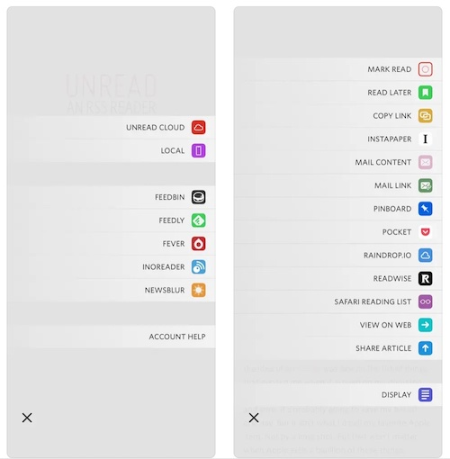
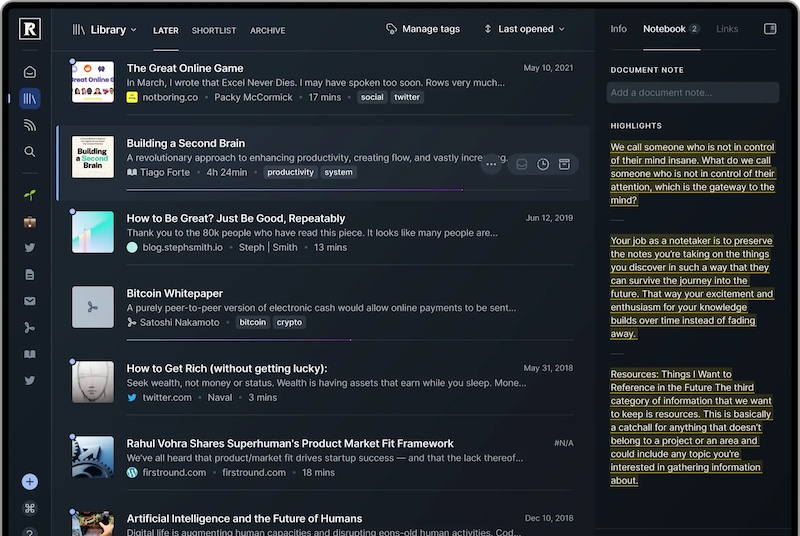
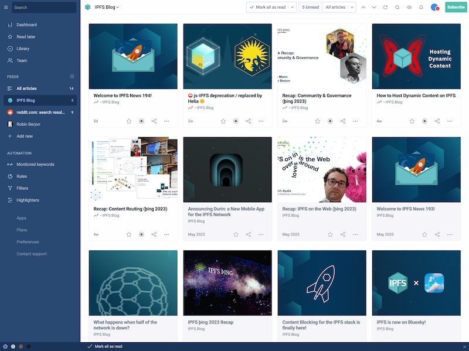
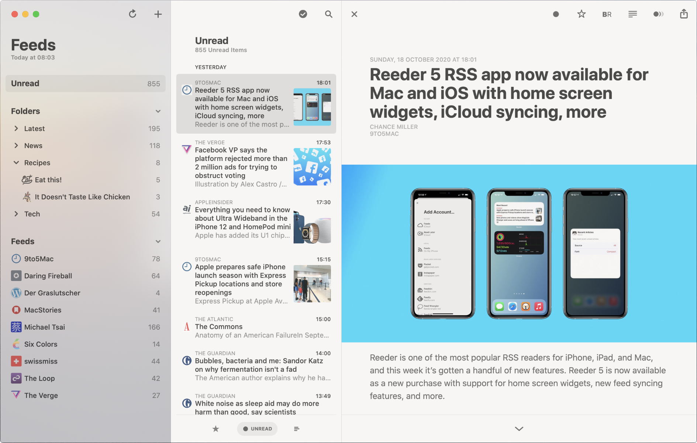
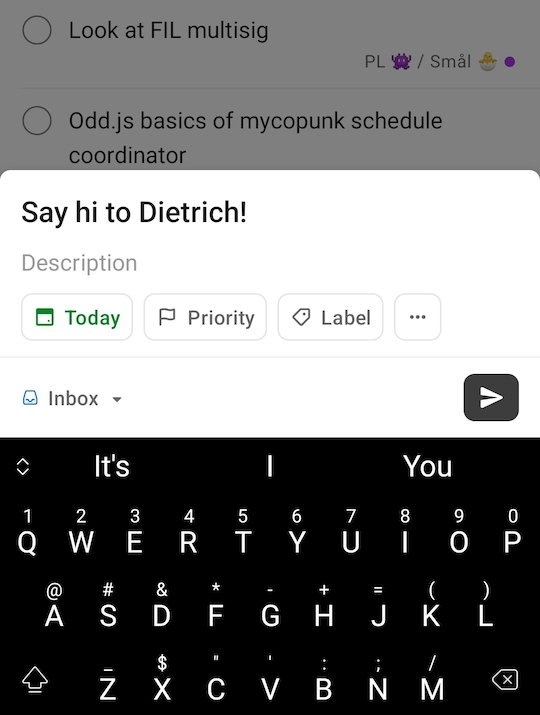

# User Interface  Notes

This is a mood board of sorts to map out what a good browser UI would be in a tiles/wishes
world.

One important goal: **NO FUCKING TABS EVER**. A content-addressed, local-first system
shouldn't need one to maintain state via windows and tabs so long as there is a good way
to organise content locally.

Generally, the idea is to obtain a UI that is suitable (desktop & mobile) for:
- social
- search
- feeds
- webified apps
- reading
- personal content management
- read-later
- app launchers

This should feel like a lot, but the goal is to replace the current browser UI so ambition is
warranted. I believe that this can be done with a relatively contained number of UI primitives.

My thesis is that the closest relative to the experience I am looking for is a feed reader.
A feed reader is great for, well, feeds obviously, but other discovery mechanisms such as
search and social are also well adapted to feed-like mental models. The reading and read-later
experience is also native to that framing, and in many ways feed readers are the OG in-app
browser, which works well here. Traditionally, there has always been a tension in the feed
world between getting a good local reading experience and visiting the site. But with a
content-addressed, local-first approach *there is no difference between those two things*.

Where feed readers fall short and where we need to depart from them some, is for anything
more app-like and interactive. This seems addressable through these paths:
1. Installed "apps" (and wishes) can be a feed (aka a "list") that is rendered as an app
   launcher.
2. A lot of the interactivity we have in mind can fit in the WebView itself, and what we
   add (wishes of various sorts) can be shown via the kind of more present chrome that
   we can count on having with a feed reader.
3. A local-first experience will likely require a local data store, and managing that
   via a feed reader UI feels viable.

Other things that are also feeds: podcasts, video site channels, newsletters. Lots of
sources:

## Inspiration

Overall, I looked at a bunch of RSS readers and read-later apps: Web Subscriber, lire,
Unread, ReadKit, Palabre, The Old Reader, Pocket, Instapaper, FeedMe, NetNewsWire, Feedbin,
Focus Reader, Leaf, The Unreader…

There are many, and many of these looked good and bring their own personality possibly
with sleeker typography, better local reading, or more data sources than others, but the
overall vibe remains the same across the board. This sort of tried-and-true core gives
me some confidence that this is a usable pattern that can be evolved.

I only flag a couple of those below, not because they were necessarily the best but because
they have this or that detail that might help.

### Readwise Reader

[Readwise Reader](https://readwise.io/read) is a reader from the Readwise folks (in case you
hadn't surmised that). It has a nice focus on readability but the part I'm interested in
here is relatively more loaded UI that has sources, filtering, and notebook highlights. This
packs a lot of information (and not everyone would probably want it this loaded all the time)
but it doesn't feel overcrowded and it shows that decent information density ought to be
feasible with this approach.

### Inoreader

[Inoreader](https://www.inoreader.com/) essentially has a clean feed UI. It's not very
featureful but the cards rendering is a nice touch (especially for people used to social
media) and they effectively use feeds as a general approach that covers traditional feeds
but also search results and live updates from their social media keyword monitoring
services.

The experience isn't particularly innovative but it's clean, and it shows how multiple
feed types can be used together seamlessly.

### Reeder 5

[Reeder](https://reederapp.com/) is a simple feed reader that looks nice. I am listing it
here because I like how it implemented a three-pane view (tree/feed/page). This feels like
it would readily extend to search and social as well.

### Todoist

It's a small detail, but the tray to create new tasks in [Todoist](https://todoist.com/) is
nicely effective and loaded with easy-to-use power.

A recurring issue is being very careful about mixing chrome and untrusted contexts, but
some part of this may be useful for wishes.

### Also Considered

- [Notability](https://notability.com/): it looks like a nice app, but it's very focused
  on note-taking in ways that don't seem transferable.
- [Zotero](https://www.zotero.org/): people who need reference management love it (for
  good reason) but the UI remains rather characteristically "open source" in ways that
  will probably turn off people who aren't research nerds.
- [Feedly](https://feedly.com/): interesting, but their focus appears to be on AI rather
  than UI. Like Inoreader, they mix multiple feed types with essentially the same
  presentation.
